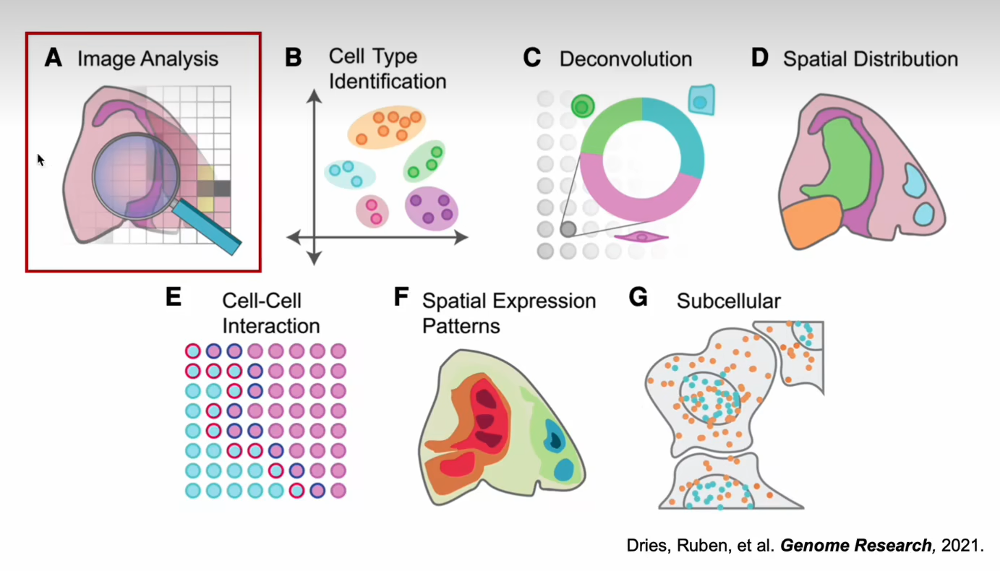

# 空间转录组技术
## 概述
Bulk → Single cell(扩展精度，单细胞的精度解析生物组织) → Spatial transcriptome(扩展空间，时空分析，凸显组织的有序性)
大部分细胞大小为10-20微米

## 空转数据能做什么？

细胞空间分布与细胞功能、疾病发生发展具有一定的关系

1. Cell types
2. (cell-cell/cell type-cell type)Spatially organization
3. Spatial context and cellular functionality(ligand-receptor; ROI)
4. Subcellular

## 空转分析的主要方面

### Image Analysis

### Cell Type Identification/ Deconvolution

工具推荐：cell2location, Tangram

### Spatial Distribution

空间共定位

SVG

空间分区

### Cell-Cell Interaction

CellPhone
引入空间信息理论上可以降低假阳性

### Spatial Expression Patterns

Tangram, gimVI

## Python 

scanpy, squidpy

Python maybe a better choice for spatial data analysis.

## More analysis with link
https://github.com/drieslab/awesome-spatial-data-analysis